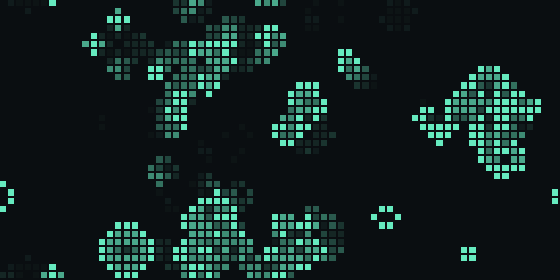

# Life Wallpaper



Conway's Game of Life as a living desktop background for macOS. It runs behind your desktop icons, on every display, and uses almost no CPU.

## Install

Paste this into Terminal:

```sh
curl -fsSL https://raw.githubusercontent.com/PSycH0buNnY01/life-wallpaper/main/install.sh | bash
```

That downloads the app into `~/Applications` and starts it. A grid icon appears in your menu bar.

**Or download it yourself:** grab `LifeWallpaper.zip` from the [latest release](https://github.com/PSycH0buNnY01/life-wallpaper/releases/latest), unzip it and drag **Life Wallpaper.app** to Applications. The app isn't notarized by Apple, so the first time you open it macOS will block it. Go to **System Settings › Privacy & Security**, scroll down and click **Open Anyway**.

Requires macOS 13 Ventura or later. Works on Apple Silicon and Intel.

## Use

Everything is in the menu bar icon:

| Menu | What it does |
| --- | --- |
| Pause / Resume | Freeze the board |
| New Soup | Start over with a fresh random board |
| Speed | 1, 4, 8 or 15 generations per second |
| Cell Size | Small, medium or large cells |
| Color | Mint, Amber, Ice, Rose, Mono |
| Motion | **Smooth** crossfades and leaves an afterglow. **Snap** jumps one hard step per generation |
| Launch at Login | Start automatically when you log in |
| Hide Menu Bar Icon | The wallpaper keeps running. Open the app again to bring the icon back |

Your choices are saved. When the pattern dies out or gets stuck in a loop, new cells are added automatically. When a display is fully covered by windows, it stops computing.

## Custom colors and settings

Any hex color works via `defaults`:

```sh
defaults write io.github.psych0bunny01.LifeWallpaper color FF7A45
defaults write io.github.psych0bunny01.LifeWallpaper bg 101010
defaults write io.github.psych0bunny01.LifeWallpaper density 0.25
```

Then quit and reopen the app. Keys: `cell` (3–80), `fps` (0.5–30), `density` (0.02–0.9), `trail` (0–60), `fade` (seconds, `-1` = auto), `color`, `bg`.

The binary also takes flags for a single run: `"Life Wallpaper.app/Contents/MacOS/LifeWallpaper" --help`.

## Uninstall

Quit from the menu bar icon (turn off Launch at Login first), then:

```sh
rm -rf ~/Applications/"Life Wallpaper.app"
defaults delete io.github.psych0bunny01.LifeWallpaper
```

## Build from source

```sh
git clone https://github.com/PSycH0buNnY01/life-wallpaper.git
cd life-wallpaper
./scripts/build.sh
open "build/Life Wallpaper.app"
```

Needs the Xcode Command Line Tools (`xcode-select --install`). It's a single Swift file with no dependencies.

## How it works

One borderless window per display sits at the desktop window level, so it's above the wallpaper and below the icons, and ignores the mouse. The simulation runs on a grid of `screen size / cell size` with wrap-around edges. Each generation is drawn as a tiny bitmap, one small block per cell, and the GPU scales it up with nearest-neighbour filtering. That keeps the CPU work negligible.

## License

MIT
